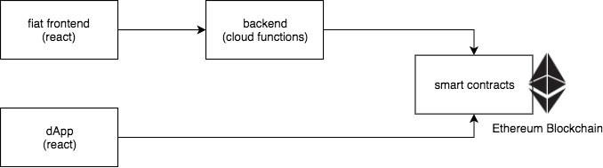

# KETTE Asset Registry (fiat) frontend

This repository contains the frontend for the KETTE registry smart contract.

You specify your asset details, an ethereum address and payment information. The app then calls the [KETTE backend](https://github.com/kette-io/nft-asset-registry-backend) that charges the credit
card accordingly and registers the asset by minting a ethereum ERC721 compliant token in the KETTE asset registry smart contract.

## Requirements

##### Credit Card

The stripe API is currently used in test-mode.
[More information on test credit cards](https://stripe.com/docs/testing#cards)

##### How to get an ethereum address
This app does not provide the creation of a ethereum account **yet**. Until implemented you can get the neeeded address following these steps:

- Go to https://www.myetherwallet.com/ .
- Enter a strong but easy to remember password.
- Click the "Create New Wallet" button.
- Click the "Download" button & save your Keystore / UTC file. Back it up.
- Read the warning. If you understand it and promise not to lose your private key, click the "I understand. Continue" button.
You now have the option of printing a paper wallet, saving your private key, or saving a QR code of your private key. Back up at least one (offline).
- Then click "Next: Save your Address"
- Unlock your wallet that you just created using the Keystore / UTC file you just downloaded or the private key.
- Save your address to a text document
- Ensure all information matches. Don't lose this information. Double check your work. Don't be dumb.

## Run
        npm install
        npm start

## Live demo (test-net)

 (soon) Click here to see it in action

## Architecture Overview

The project comprises of four modules. Each module with its individual repository:

- fiat frontend (this repository)
- [dApp](https://github.com/kette-io/nft-asset-registry-dapp)
- [backend](https://github.com/kette-io/nft-asset-registry-backend)
- [smart contracts](https://github.com/kette-io/nft-asset-registry-smart-contracts)

## Todo
- show assets for a specific account
- individual asset view
- creation of ethereum address.
- input validation

#### Credits

This app is based on [Material Kit React Version](https://github.com/creativetimofficial/material-kit-react)

